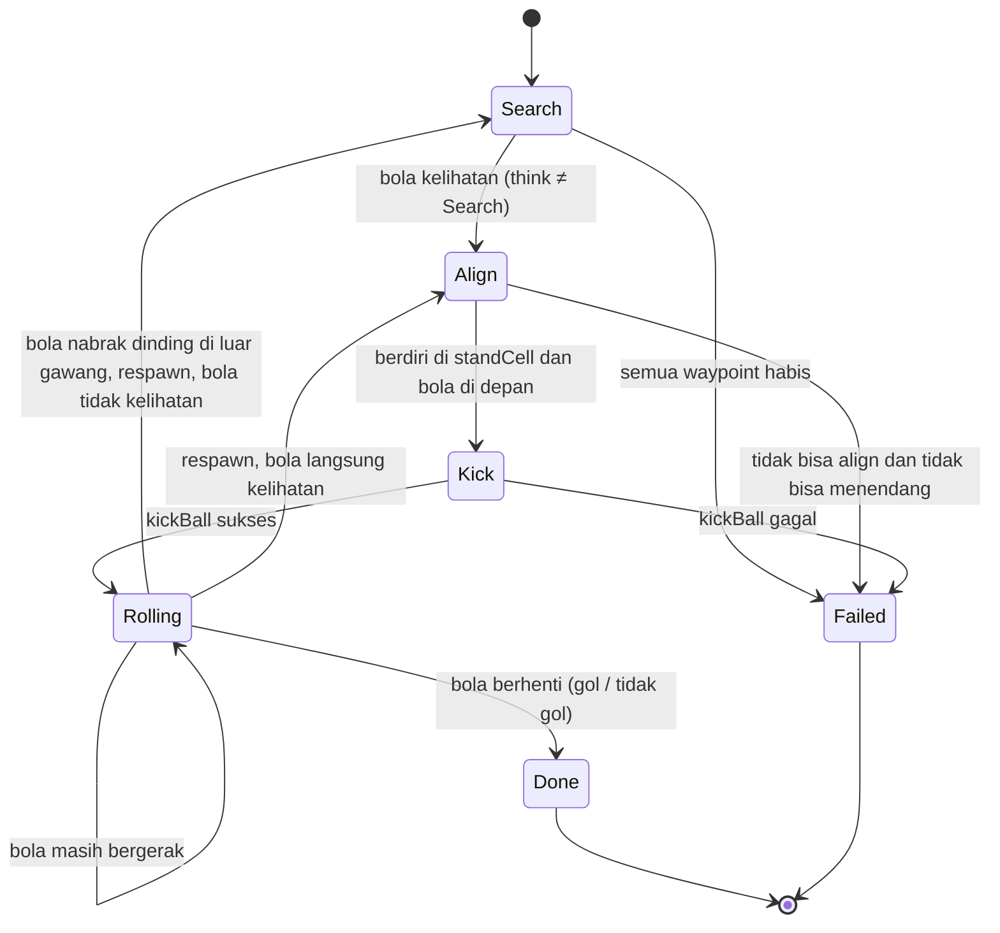
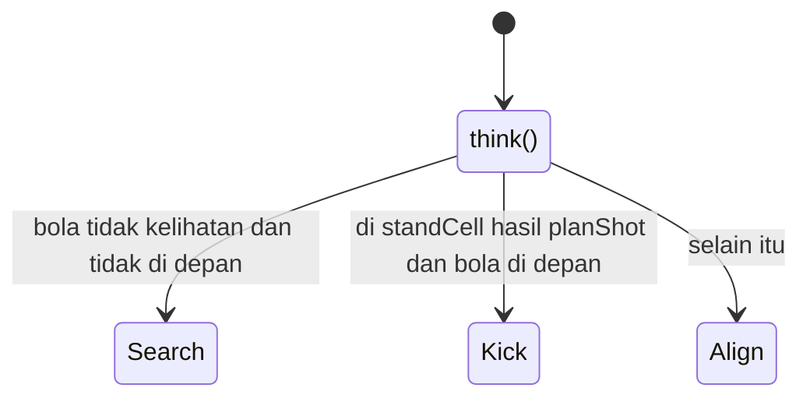

# Mainan Robot: Striker Simulation

Simulasi robot striker di lapangan 9 m x 6 m (grid petak 0,5 m, 18 x 12 petak) dengan gawang di sisi kanan (x = 4,5 m, lebar 3 m). Robot mencari bola, mengatur posisi tendang, lalu menendang bola ke gawang. Ditulis dalam C++ dengan prinsip OOP.

## Panduan Running

### Kebutuhan

Compiler C++ yang mendukung C++17 (misalnya g++ / MinGW-w64).

### Compile

Dari folder yang berisi semua file `.cpp` dan `.h`:

```bash
g++ -std=c++17 -Iinclude src/*.cpp -o sim

or 

g++ -std=c++17 -Iinclude src/Ball.cpp src/Field.cpp src/Goal.cpp src/Robot.cpp src/Simulator.cpp src/Striker.cpp src/main.cpp -o sim
```

### Jalankan

```bash
./sim        # Linux / macOS
sim.exe      # Windows
```

Program meminta dua koordinat dalam meter, format `x y` dipisah spasi:

```
Koordinat robot (x y): -3 0
Koordinat bola (x y): 0 0
```

Aturan input:

- `x` harus di rentang -4,5 sampai 4,5 dan `y` di rentang -3 sampai 3. Di luar itu program meminta ulang.
- Bola tidak boleh satu petak dengan robot. Kalau sama, bola diminta ulang.
- Input harus berupa angka. Kalau bukan, program meminta ulang.

Simulasi digambar langsung di terminal. Arti simbolnya:

| Simbol | Arti |
| --- | --- |
| `R` | robot |
| `O` | bola |
| `@` | petak yang terlihat kamera robot |
| `#` | petak gawang |
| `.` | petak kosong |

Satu tick dihitung 1 detik waktu simulasi dan digambar tiap 100 ms. Simulasi berhenti saat selesai (Done / Failed) atau mencapai batas 500 tick. Di Windows, warna dan penimpaan layar memakai ANSI yang diaktifkan otomatis oleh program.

## Skenario Uji

Hasil berikut didapat dengan menjalankan program sungguhan (posisi dalam meter, waktu dalam detik simulasi).

| # | Robot | Bola | Tujuan skenario | Hasil |
| --- | --- | --- | --- | --- |
| 1 | (0, 0) | (0,2, 0,2) | Bola sangat dekat dan langsung terlihat kamera | GOL, 6 detik |
| 2 | (-3, 0) | (0, 0) | Bola jauh di tengah, robot harus scan lalu berjalan | GOL, 89 detik |
| 3 | (-3, 0) | (4, -2,5) | Bola dekat gawang di pojok, tendangan keluar gawang dan bola di-respawn | GOL, 185 detik, respawn 1x |
| 4 | (-4,4, 2,9) | (4,4, -2,9) | Robot dan bola di pojok berseberangan (kasus terjauh) | GOL, 183 detik, respawn 1x |
| 5 | (-3, 0) | (-3, 1,5) | Bola jauh dari gawang (sekitar 7,5 m), satu tendangan tidak cukup | Tidak gol, 8 detik |
| 6 | (-3, 0) | (-4, 2) | Bola menempel dinding kiri, paling jauh dari gawang | Tidak gol, 17 detik |
| 7 | (2, 0) | (-3, 0) | Robot berada di sisi gawang, bola jauh di belakangnya (7,5 m dari gawang) | Tidak gol, 24 detik |
| 8 | (0, 0) | (0, 0) | Validasi: bola satu petak dengan robot | Ditolak, bola diminta ulang |
| 9 | (9, 9) lalu (-3, 0) | (-1, 1) | Validasi: posisi robot di luar lapangan | Ditolak, robot diminta ulang, lalu GOL 30 detik |

Catatan membaca hasil:

- **GOL**: bola berhenti di petak garis gawang dan di dalam lebar gawang.
- **Tidak gol**: simulasi selesai (state Done) tapi bola berhenti di tempat lain. Tendangan robot hanya punya tenaga awal 3 m/s dan melambat 1 m/s tiap tick, jadi bola hanya menempuh jarak terbatas.
- **Respawn**: kalau bola menabrak dinding di luar gawang, bola dikembalikan ke tengah lapangan dan robot mencari dari awal. Jumlahnya ditampilkan di layar.
- **Failed**: terjadi kalau bola tidak ketemu setelah semua waypoint dijelajahi, atau robot tidak bisa menendang. Tidak muncul di skenario di atas.

## Alur State Kecerdasan Striker

Kecerdasan robot dibagi dua lapis: `Simulator` mengatur state besar, sedangkan `Striker::think()` memutuskan aksi di tiap tick.

### State pada Simulator



1. **Search**: robot memutar 45° sebanyak 8 kali (satu lingkaran) sambil cek kamera. Kalau belum ketemu, robot berjalan ke waypoint berikutnya (pola zig-zag di lapangan) lalu scan lagi. Begitu bola kelihatan, pindah ke Align. Kalau semua waypoint habis, Failed.
2. **Align**: `planShot()` mencoba 8 petak di sekitar bola dan 3 arah tendangan (lurus, miring +45°, miring -45°), mensimulasikan ke mana bola berakhir, lalu memilih yang masuk gawang (atau yang paling searah gawang, lalu yang paling dekat dijalani). Robot berjalan ke petak itu sambil menghindari petak bola, lalu menghadap bola. Posisi bola tetap diingat walau sempat keluar dari kamera.
3. **Kick**: `kickBall()` menendang dengan arah terbaik relatif hadapan robot. Kalau bola tidak tepat di petak depan robot, Failed.
4. **Rolling**: bola bergerak dan melambat tiap tick. Kalau berhenti, Done. Kalau menabrak dinding di luar gawang, bola di-respawn ke tengah dan state kembali ke Search (atau Align kalau bolanya kebetulan kelihatan).

### Keputusan `Striker::think()`



Berbeda dengan `Robot::think()` dasar (yang menendang begitu bola kebetulan di depan), `Striker` hanya menendang dari petak yang sudah direncanakan `planShot()`, sehingga arah tendangannya selalu dipilih secara sengaja.

## Penggunaan AI

Proyek ini dikerjakan dengan bantuan asisten AI (model bahasa besar). Semua kode sudah dibaca, dijalankan, dan diuji sendiri, dan hasil di bagian Skenario Uji berasal dari program sungguhan.

### Bagian yang dibantu AI

| Bagian | Bentuk bantuan |
| --- | --- |
| Struktur kelas OOP | Diskusi pembagian tanggung jawab antara `Robot`, `Striker`, `Simulator`, `Field`, `Ball`, dan `Goal` |
| Logika `planShot()` | Ide pendekatan: mencoba 8 petak di sekitar bola dan 3 arah tendangan, lalu mensimulasikan hasilnya |
| Rendering terminal | Bantuan memakai ANSI escape code, termasuk pengaktifannya di Windows |
| Debugging | Membantu mencari penyebab bug, misalnya bola respawn atau robot gagal align |
